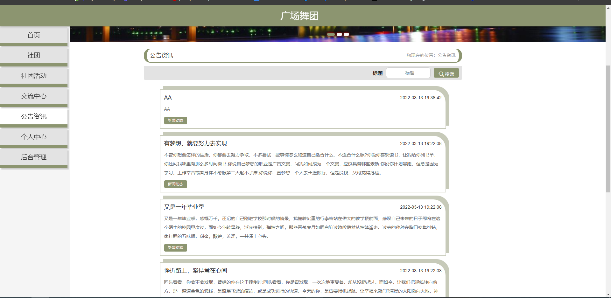
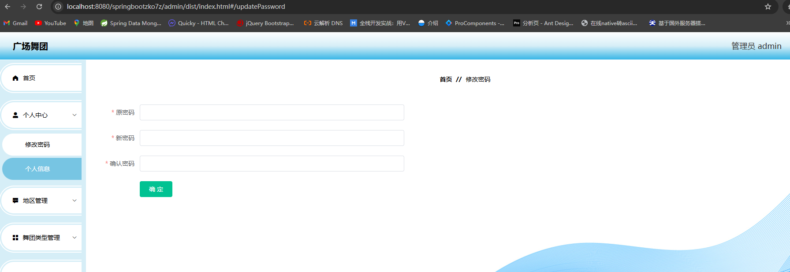
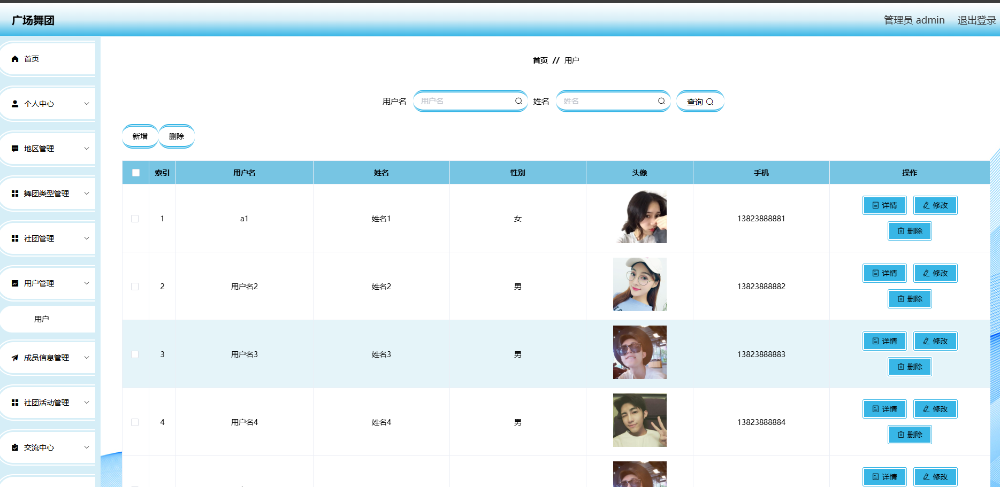

# 一、系统说明

基于springboot+vue+elementui开发的广场舞团系统,系统功能齐全, 代码简洁易懂，适合小白学编程。

# 二、系统架构

######      前端：vue| elementui

######      后端：springboot | mybatis 

######      环境：jdk1.8+ | mysql8.0+ | maven

# 三、代码及数据库

# 四、相关功能介绍

#### 1).客户端

###### 1.登录

###### 2.注册

###### 3.首页

###### 4.社团

###### 5.社团活动

###### 6.交流中心

###### 7.公告资讯

###### 8.个人中心

###### 9.后台->成员信息

###### 10.后台->我的收藏管理

包括:新增、删除功能

#### 2).管理端

###### 1.登录

###### 2.广场舞团注册

###### 3.个人中心->修改密码

###### 4.地区管理

包含:详情、删除、修改、查看、新增功能

###### 5.舞团类型

包含:详情、删除、修改、查看、新增功能

###### 6.社团管理

包含:详情、删除、修改、查看、新增功能

###### 7.用户管理

包含:详情、删除、查询、新增功能

###### 8.社团成员管理

###### 9.社团活动

包含:详情、删除、修改功能

###### 10.交流中心

包含:详情、修改、删除功能

###### 11.系统管理->轮播图管理

###### 12.系统管理->公告资讯

###### 13.社团登录

功能与管理员差不多，可新增社团活动

######
